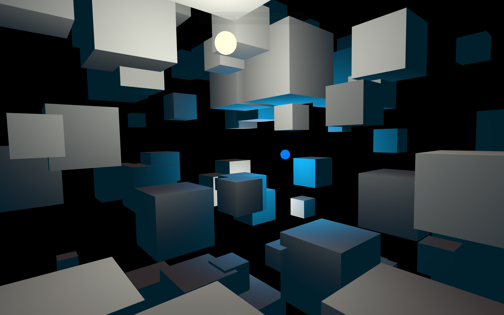
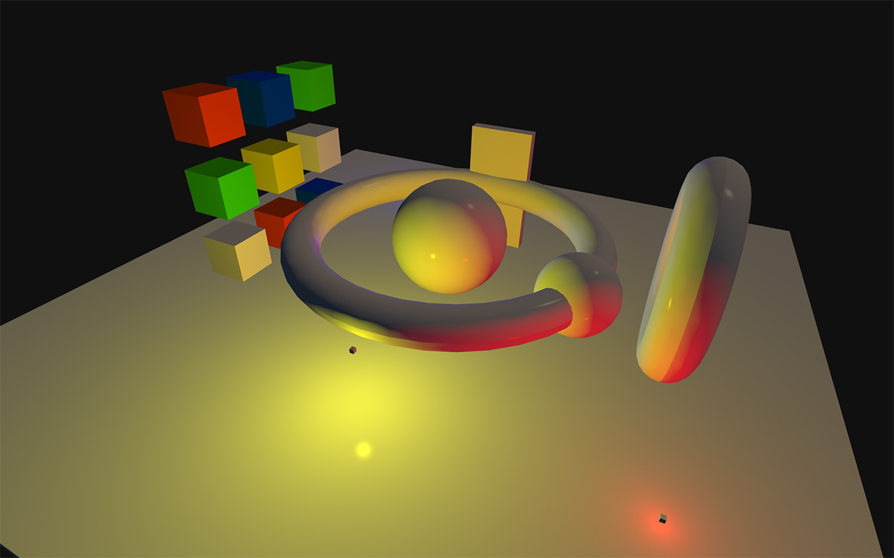
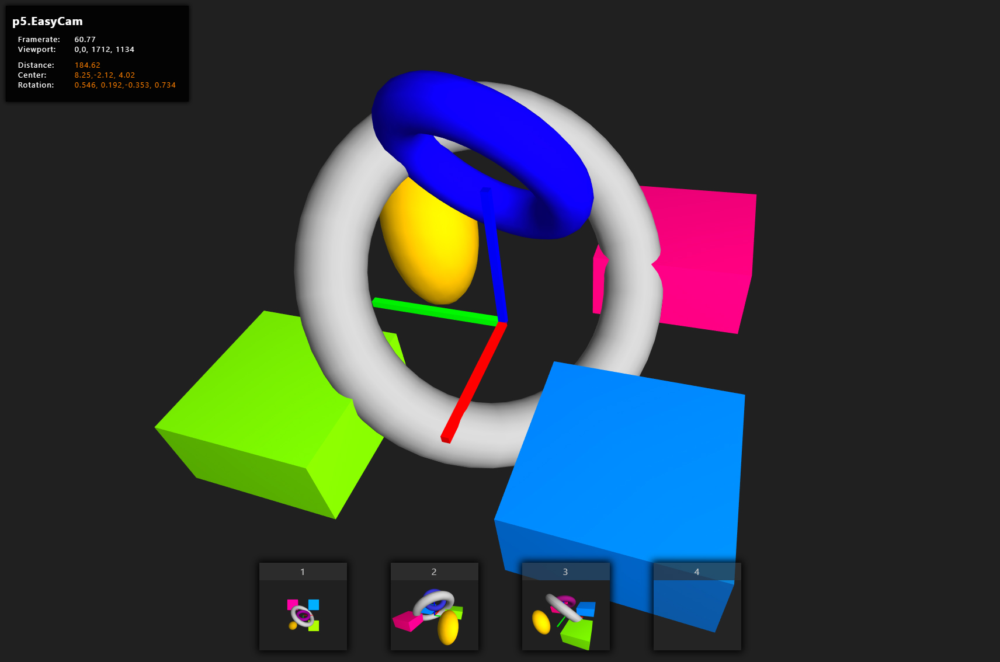

# p5.EasyCam

Simple 3D camera control for [p5js](https://p5js.org/) and the WEBGL renderer.

This library is a derivative of the original PeasyCam Library by Jonathan Feinberg 
and combines new useful features with the great look and feel of the original version.
This p5js library version was started by Thomas Diewald in 2017.

Processing/Java version of this project: https://github.com/diwi/peasycam/tree/PeasyCam3

Original (abandoned) fork source: https://github.com/diwi/p5.EasyCam


## Releases

- [p5.easycam.js](https://rawgit.com/jwdunn1/p5.EasyCam/master/p5.easycam.js)
- [p5.easycam.min.js](https://rawgit.com/jwdunn1/p5.EasyCam/master/p5.easycam.min.js)
- [All Releases](https://github.com/jwdunn1/p5.EasyCam/releases)


## Examples

#### EasyCam.js - Advanced Shader/Lighting
- [RandomBoxes](https://jwilliamdunn.com/p5.EasyCam/examples/RandomBoxes/)
- [AnimatedPointLights](https://jwilliamdunn.com/p5.EasyCam/examples/AnimatedPointLights/)
- [PerPixelPhong](https://jwilliamdunn.com/p5.EasyCam/examples/PerPixelPhong/)

#### EasyCam.js - Basic
- [CameraStates](https://jwilliamdunn.com/p5.EasyCam/examples/CameraStates/)
- [CameraStates_Basic](https://jwilliamdunn.com/p5.EasyCam/examples/CameraStates_Basic/)
- [HeadUpDisplay](https://jwilliamdunn.com/p5.EasyCam/examples/HeadUpDisplay/)
- [QuickStart](https://jwilliamdunn.com/p5.EasyCam/examples/QuickStart/)
- [QuickStart_Ortho](https://jwilliamdunn.com/p5.EasyCam/examples/QuickStart_Ortho/)
- [SplitView](https://jwilliamdunn.com/p5.EasyCam/examples/SplitView/)
- [MultiView](https://jwilliamdunn.com/p5.EasyCam/examples/MultiView/)


## Usage

```javascript
var easycam;

function setup() { 
  createCanvas(windowWidth, windowHeight, WEBGL);

  easycam = createEasyCam();
  // easycam = new Dw.EasyCam(this._renderer);
  // easycam = new Dw.EasyCam(this._renderer, {distance:300, center:[0,0,0]});
  // easycam = new Dw.EasyCam(this._renderer, {distance:300, center:[0,0,0], rotation:[1,0,0,0]});
} 

function draw(){
  background(64);
  fill(255);
  box(200);
}
```
something to play with: [jsfiddle](https://jsfiddle.net/intrinsica/n95sgbvr/)


## Reference

  - [p5.EasyCam.documentation](https://jwilliamdunn.com/p5.EasyCam/documentation/p5.easycam.docs.md)
  
  
```javascript

##
## QUICKREF
##


## CAMERA SETUP

// constructor
new Dw.EasyCam(p5.RendererGL, state);
new Dw.EasyCam(p5.RendererGL, {
      distance : z,                 // scalar (optional)
      center   : [x, y, z],         // vector (optional)
      rotation : [q0, q1, q2, q3],  // quaternion (optional)
      viewport : [x, y, w, h],      // array (optional)
    }

// examples
createEasyCam(); // uses the primary WEBGL renderer and default settings
 ...
createEasyCam(p5.RendererGL);
createEasyCam(p5.RendererGL, {distance:z});
createEasyCam(p5.RendererGL, {distance:z, center:[x,y,z]});
  ... 
new Dw.EasyCam(p5.RendererGL);
new Dw.EasyCam(p5.RendererGL, {distance:z});
new Dw.EasyCam(p5.RendererGL, {distance:z, center:[x,y,z]});
  ... 

## CAMERA STATE

state = {
  distance : z,                 // scalar
  center   : [x, y, z],         // vector
  rotation : [q0, q1, q2, q3],  // quaternion
}


## CAMERA METHODS

// CAMERA, MISC
setCanvas(renderer) // webgl-renderer
getCanvas()
setViewport(viewport) // viewport as bounding screen-rectangle [x,y,w,h]
getViewport()
update() // update camera state
apply(renderer) // apply camera state to webgl-renderer
dispose()
setAutoUpdate(status)
getAutoUpdate()
attachMouseListeners(renderer) // input handler
removeMouseListeners()

// INPUT BEHAVIOUR/SCALE/SPEED
setZoomScale(scale_zoom)
getZoomScale()
setPanScale(scale_pan)
getPanScale()
setRotationScale(scale_rotation)
getRotationScale()
setWheelScale(wheelScale)
getWheelScale()
setDefaultInterpolationTime(duration)
setDamping(damping)
setRotationConstraint(yaw, pitch, roll)

// GET ZOOM/PAN/ROTATE/POSITION/UP
getCenter()
getDistance()
getRotation()
getUpVector(dst)
getPosition(dst)

// SET ZOOM/PAN/ROTATE
setDistanceMin(distance_min)
setDistanceMax(distance_max)
setDistance(distance, duration)
setCenter(center, duration)
setRotation(rotation, duration)
setInterpolatedCenter(valA, valB, t)
setInterpolatedDistance(valA, valB, t)
setInterpolatedRotation(valA, valB, t)

// MODIFY ZOOM/PAN/ROTATE
zoom(dz)
panX(dx)
panY(dy)
pan(dx, dy)
rotateX(rx)
rotateY(ry)
rotateZ(rz)
rotate(axis, angle)

// CAMERA STATES
setState(other, duration)
getState()
pushState()
popState(duration)
pushResetState()
reset(duration)

// HEAD_UP_DISPLAY
beginHUD(renderer, w, h)
endHUD(renderer)

```


## Screenshots







